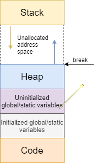

# Writing a memory allocator

This is another small coding exercise that I took to understand memory allocators. Inspired from [Arjun](https://arjunsreedharan.org)'s [Memory Allocators 101](https://arjunsreedharan.org/post/148675821737/memory-allocators-101-write-a-simple-memory) post.

## Process Memory Layout

Here's is what a process address space looks like:

A Process' virtual address space begins from the code section. After the code is laid out, the next section contains initialized global and static data. This region stores all the initialized global and static variables. Uninitialized global and static variables follow next with that mapped to zero pages (as they must be initialized to zero). As soon as the process begins to write to those variables, new zero pages are allocated to the process (lazy allocation).

The stack and heap are the ones that are generally keep changing in size (stack, because we dont know how deep a function call chain can go and heap, because we dont know who much memory is allocated by the process. So, to tackle with this, the stack grows top to bottom and the heap grows bottom to top (with reference to the above figure). The address space in between stack and heap is actually unused (and unallocated). The area where heap ends in the process space is called (for historical reasons) a **break**. The address space literally breaks (stops) there! That said, the stack space is limited to some size (varies from 2MB to 8MB) and it does not dynamically grow in the address space like heap does. Although, a stack limit can be changed dynamically with `setrlimit` call with `RLIMIT_STACK` resource specified.

The system call that changes this break in the address space is `sbrk`. `sbrk(0)` gives the current break in the address space, `sbrk(x)` increases the address space by `x` bytes, while `sbrk(-x)` gives back `x` bytes to the operating system.
